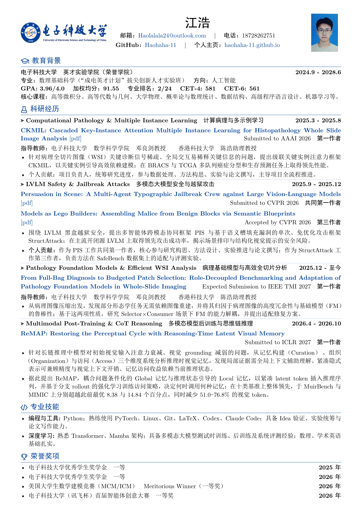
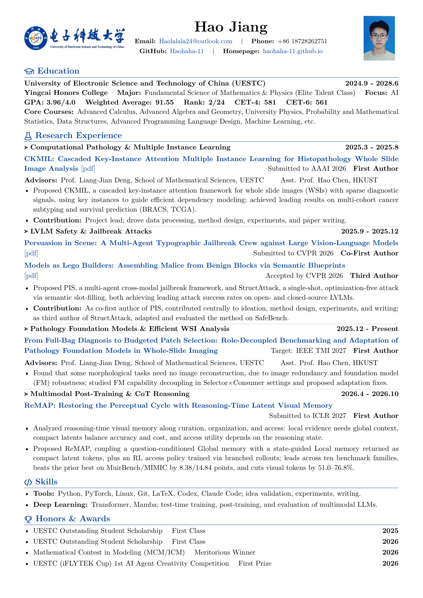

<div align="center">

# Hao Jiang · Academic Resume

**A one-page, research-oriented academic resume built with XeLaTeX**<br>
**江浩的单页科研简历 · 基于 XeLaTeX 构建**


[**中文版 PDF**](./main.pdf) · [**English PDF**](./main_en.pdf) · [**LaTeX 源码**](./main.tex) · [**English Source**](./main_en.tex) · [**个人主页**](https://haohaha-11.github.io/) · [**GitHub**](https://github.com/Haohaha-11)

</div>

---

## About / 项目简介

This repository contains the source, compiled PDFs, and rendered previews of **Hao Jiang's academic resume**, in both Chinese and English. The resume is designed for research internship, graduate application, and academic collaboration scenarios, with an emphasis on a compact one-page structure and a clear presentation of research experience.

本仓库保存江浩个人学术简历的 **LaTeX 源码、可直接阅读的 PDF 以及高清预览图**，提供中文与英文两个版本。简历主要面向科研实习、研究生申请与学术合作场景，在一页 A4 版面内集中呈现教育背景、科研经历、专业技能与荣誉奖项。

当前研究兴趣覆盖计算病理、多示例学习、大视觉语言模型安全、病理基础模型以及多模态模型后训练与推理时视觉记忆。

## Resume Preview / 简历预览

| 中文版 | English |
| --- | --- |
| [](./main.pdf) | [](./main_en.pdf) |

> 点击预览图可打开完整 PDF。Each preview image links to the corresponding compiled PDF.

## Profile at a Glance / 基本信息

| Item | Details |
| --- | --- |
| Education | University of Electronic Science and Technology of China (UESTC), Honors College |
| Program | Mathematical Foundations of Science, Yingcai Experimental Program |
| Direction | Artificial Intelligence |
| Research Focus | Computational Pathology, MIL, LVLM Safety, Pathology Foundation Models, Multimodal Post-Training |
| Resume Format | A4, one page, 10 pt, Chinese (`main.tex`) and English (`main_en.tex`) versions |
| Typesetting Engine | XeLaTeX (`ctex` for Chinese, `fontspec` for English) |
| Last Content Update | 2026-10-01 |

## Research Portfolio / 科研方向

The resume summarizes four connected research tracks:

| Track | Representative Work | Status shown in resume |
| --- | --- | --- |
| Computational Pathology & Multiple Instance Learning | **CKMIL** — key-instance-guided dependency modeling for whole-slide image analysis | Submitted to AAAI 2026 · First Author |
| LVLM Safety & Jailbreak Attacks | **Persuasion in Scene** and **Models as Lego Builders** | CVPR 2026 submission / acceptance |
| Pathology Foundation Models & Efficient WSI Analysis | Role-decoupled benchmarking and adaptation under budgeted patch selection | Expected Submission to IEEE TMI 2027 · First Author |
| Multimodal Post-Training & CoT Reasoning | **ReMAP** — reasoning-time latent visual memory with Global/Local memories and an RL-learned access policy | Submitted to ICLR 2027 · First Author |

The repository is intended to track the resume presentation rather than host the full research codebases. Paper links available in the PDF are preserved as clickable hyperlinks.

## Design Highlights / 设计特点

- **One-page information architecture** — education, four research tracks, skills, and awards are fitted into a single A4 page while preserving readable hierarchy.
- **Research-first layout** — each project begins with its research field and date, followed by the paper title, submission status, authorship, and concise contribution summary.
- **Consistent visual identity** — section headings, rules, hyperlinks, and accent elements use a blue palette derived from the UESTC visual identity.
- **Compact but reproducible typography** — the document uses a 10 pt base size, carefully controlled margins, custom list spacing, and lightweight project separators.
- **Clickable academic links** — email, GitHub profile, personal homepage, and available paper PDFs are embedded directly in the exported document.
- **Portable assets** — the university logo, portrait, source file, compiled PDF, and rendered preview are versioned together.

## Repository Structure / 仓库结构

```text
Resume-Haojiang/
├── README.md
├── main.tex                         # XeLaTeX source (Chinese)
├── main.pdf                         # Latest compiled resume (Chinese)
├── main_en.tex                      # XeLaTeX source (English)
├── main_en.pdf                      # Latest compiled resume (English)
├── assets/
│   ├── portrait-user.jpg            # Profile portrait
│   └── uestc-horizontal-logo.png    # UESTC horizontal logo
└── preview/
    ├── resume-page-1.png            # High-resolution preview (Chinese)
    └── resume-en-page-1.png         # High-resolution preview (English)
```

LaTeX-generated intermediate files are excluded through `.gitignore` so that the repository remains focused on source and deliverables.

## Build Locally / 本地编译

### Requirements

- A recent [TeX Live](https://www.tug.org/texlive/) or [MiKTeX](https://miktex.org/) installation
- XeLaTeX
- LaTeX packages used by the source:
  - `extarticle`
  - `ctex` (Chinese version)
  - `fontspec` (English version)
  - `geometry`
  - `enumitem`
  - `titlesec`
  - `hyperref`
  - `xcolor`
  - `graphicx`
  - `tikz`

### Compile

Run XeLaTeX twice from the repository root so that hyperlinks and layout references are fully refreshed:

```bash
xelatex -interaction=nonstopmode -halt-on-error main.tex
xelatex -interaction=nonstopmode -halt-on-error main.tex
xelatex -interaction=nonstopmode -halt-on-error main_en.tex
xelatex -interaction=nonstopmode -halt-on-error main_en.tex
```

The generated files will be available as `main.pdf` and `main_en.pdf`.

On MiKTeX, missing packages may be installed automatically during the first build. For a clean CI environment, install the required packages before compiling.

## Customization Guide / 修改指南

Each language version is intentionally kept in a single file (`main.tex` / `main_en.tex`) with the same macros, to make future maintenance straightforward.

1. **Personal information** — edit the name, email, phone, GitHub, and homepage fields in the header block.
2. **Logo and portrait** — replace the corresponding files under `assets/` while keeping the filenames unchanged, or update their paths in `main.tex`.
3. **Education** — update the institution, program, direction, dates, GPA, ranking, language scores, and core coursework in the education section.
4. **Research experience** — reuse the custom `\researchentry`, `\paperentry`, `\projectheading`, and `\projectseparator` commands to maintain consistent hierarchy.
5. **Colors** — adjust the `uestcblue` definition and hyperlink configuration near the beginning of `main.tex`.
6. **Page density** — tune `geometry`, list spacing, title spacing, and project-separator spacing carefully; always rebuild and inspect the full page after changing them.

For adaptation to another person, replace all personal information, portrait assets, institutional branding, academic records, project descriptions, and hyperlinks before publishing.

## Maintenance Workflow / 维护流程

When updating the resume:

1. Edit `main.tex` and `main_en.tex` together (keep both versions in sync), plus any necessary files in `assets/`.
2. Compile each file twice with XeLaTeX.
3. Confirm the output remains exactly one A4 page and check for overfull or underfull box warnings.
4. Inspect the rendered page at high resolution, especially long paper titles, right-aligned submission metadata, project separators, and the bottom margin.
5. Replace `main.pdf`, `main_en.pdf`, and both preview images under `preview/` in the same commit so that the sources, PDFs, and repository previews remain synchronized.

## Privacy and Usage Notice / 隐私与使用说明

This repository is a personal resume archive and contains personally identifiable information, including contact details and a portrait. The personal information, photograph, institutional marks, academic records, and research descriptions are **not reusable as template content**.

本仓库包含个人联系方式与证件照。若你参考其排版结构制作自己的简历，请务必替换全部个人信息和素材，并根据学校或机构的品牌规范使用相关标识。除非仓库另行添加明确许可证，否则不应假定其中的个人内容或视觉资产已获得再分发授权。

## Contact / 联系方式

- GitHub: [@Haohaha-11](https://github.com/Haohaha-11)
- Homepage: [haohaha-11.github.io](https://haohaha-11.github.io/)
- Email: [Haolalala24@outlook.com](mailto:Haolalala24@outlook.com)

---

<div align="center">

Maintained by **Hao Jiang** · Built with **XeLaTeX**

</div>
